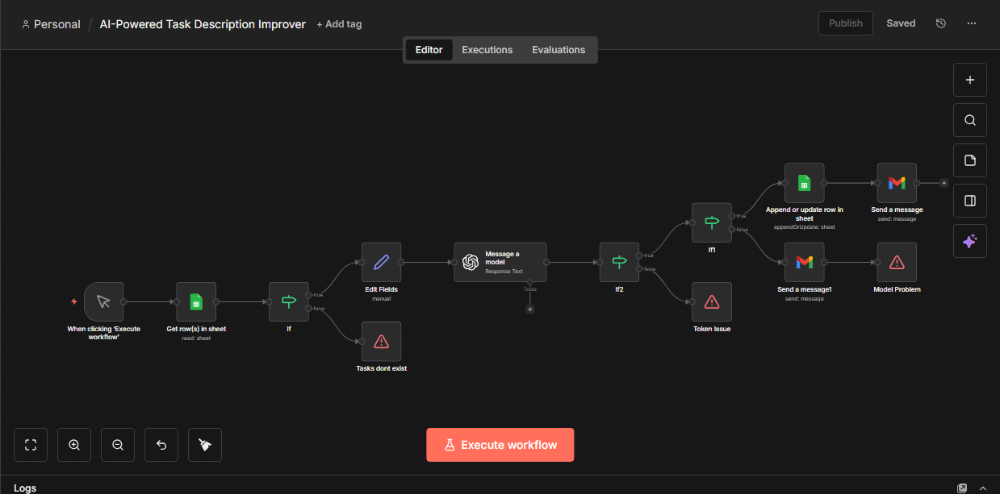

## AI-Powered Task Description Improver (n8n)

## 📌 Overview
This project is a real-world **AI-powered automation workflow built using n8n**.  
It takes raw or poorly written task descriptions from **Google Sheets**, improves them using **OpenAI**, and writes the enhanced version back into the spreadsheet automatically.

The workflow is designed to demonstrate **practical automation skills**, including data preparation, AI integration, validation logic, and structured updates — all without relying on paid third-party tools beyond OpenAI.

---

## 🎯 What This Automation Does
- Reads task descriptions from Google Sheets
- Validates input data before processing
- Sends tasks to OpenAI for rewriting
- Generates clear, professional, and actionable task descriptions
- Updates the improved tasks back into Google Sheets
- Marks tasks as processed
- Includes basic error handling and optional email notifications

---

## 🧠 Real-World Use Cases
- Task cleanup for teams and agencies
- Improving internal to-do lists
- Preparing clear task instructions for clients or collaborators
- Productivity and workflow optimization
- AI-assisted content refinement

---

## 🧩 Workflow Structure

1. **Trigger (Manual / Google Sheets)**
   - Starts the workflow for testing or execution.

2. **Google Sheets – Read**
   - Reads task data from a spreadsheet.
   - Each row is treated as a separate workflow item.

3. **Set Node – Data Preparation**
   - Extracts and cleans the task text.
   - Ensures only relevant data is passed to the AI model.

4. **Validation (If Nodes)**
   - Confirms task data exists before processing.
   - Prevents unnecessary API calls.

5. **OpenAI Node**
   - Rewrites the task description using AI.
   - Uses a controlled prompt for consistent output.

6. **Set Node – Output Cleanup**
   - Extracts only the AI-generated text from the response.
   - Renames it into a clean, usable field.

7. **Google Sheets – Update**
   - Writes the improved task back to the spreadsheet.
   - Updates task status to indicate completion.

8. **Optional Notifications**
   - Sends email alerts for success or error states.

---

## 📸 Workflow Screenshot

---

## 📂 Files in This Repository

| File Name | Description |
|---------|------------|
| `AI-Powered Task Description Improver.json` | Exported n8n workflow |
| `image.png` | Screenshot of the complete workflow |
| `README.md` | Project documentation |

---

## ⚙️ How to Use This Workflow

1. Import the JSON workflow into your n8n instance
2. Connect Google Sheets credentials
3. Connect OpenAI credentials
4. Prepare a Google Sheet with task data
5. Execute the workflow manually or via trigger
6. Review improved tasks directly in Google Sheets

---

## 🔑 Key Concepts Demonstrated
- Workflow automation design
- Google Sheets as a data source
- OpenAI integration in n8n
- JavaScript expressions for data handling
- Input and output validation
- Clean data transformation
- Practical AI usage

---

## 🚀 Why This Project Matters
This automation reflects **real production-style logic**, not toy examples.  
It demonstrates the ability to design workflows that are:
- Reliable
- Maintainable
- Useful in real business scenarios

The project was built independently as part of a structured n8n learning journey.

---

## 📌 Status
✅ Completed  
📈 Portfolio-ready  
🧠 Built with a focus on understanding, not copying
**
